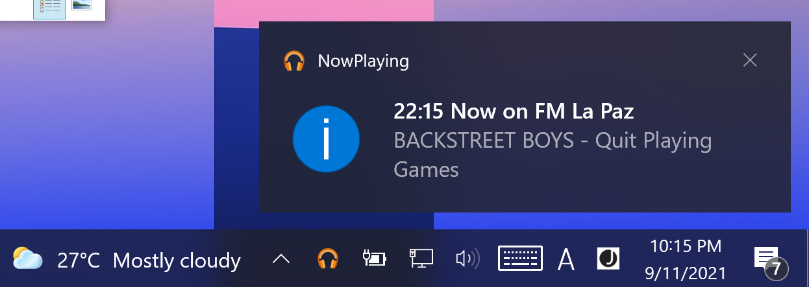

## Now Playing on FM La Paz (Windows version)

#installation process:

Download $this folder as a zip file and expand it to any folder

Go to bin/Debug/net5.0-windows/ directory

and Execute (Run): NowPlaying.exe

Done! 

The application will run as soon as is minimized

it will show at the System Tray the current song playing on https://www.lapaz.fm .

It took me about 4hours to develop this application.

Thanks to all the following references:

1. [Fetch JSON](https://zetcode.com/csharp/json/)

2. [Build System Tray App](https://youtu.be/-6bvqwVYwMY)

3. [Async and JSON](https://docs.microsoft.com/en-us/dotnet/csharp/language-reference/keywords/async)

4. VisualStudio intellisense, without it 52 issues would continue be unsolved.

5. The application icon is from [here](https://icon-icons.com/)

-------

Programming language: C#

Editor: VS Code

Environment: Panasonic Let's Note/ Windows10 Pro