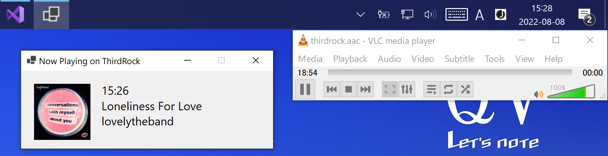
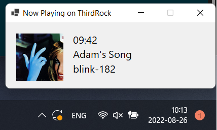

## Now Playing on ThirdRock (Windows version)

The fecthed URL from FMLaPaz.fm cannot be parsed on C# due to a Security issue and peer. Thus, this app no longer displays the current playing song on fm LaPaz but another station: *Third Rock*.

As a bonus I added one extra feat. on the GUI --artwork--.

### Installation:

! Run this app at your own risk.

**Pre-Release** 
Please download one of the following and expand it to any folder and execute the file *NowPlaying.exe*.

- Windows7, 10 version is available [here](https://github.com/ndlopez/NowPlaying/raw/master/pre-release.zip). Requires Windows Desktop Runtime v5.0, apparently still supported on Windows7

- Windows 10,11 version is available [here](https://github.com/ndlopez/NowPlaying/raw/master/NowPlaying_newGUI.zip). Requires Windows Desktop Runtime v3.1

A warning (about running software from unknown sources) will pop up, just click OK to continue.

> This application does NOT collect any sort of data and is NOT associated by any way nor means with thirdrockradio.net.

To update right-click on the icon (headphones) then select <Update> option. 
It is also possible to update by selecting <Show> to display the app and then minimize again.

## Developing mode
~If by any chance you have VS installed on your PC (~8GB) then pull this project and expand it on any folder (C:\/user/source/repos/) and open the project file <NowPlaying.csproj>. 

### Known issues:

1. The application will run as soon as is minimized. It will show at the System Tray 
the current song playing on [ThirdRockRadio](thirdrockradio.net) -- which is set by default.
2. It should auto-update after 4minutes, however due to a problem with an async function it does not.
3. VS Community Ed. no longer supports Framework NET 5.0, therefore, the following files should be updated to a long-term version:

	- NowPlaying.cs: 5 netcoreapp3.1
	- obj/NowPlaying.csproj.nuget.dgspec.json, change all NET 5.0 to netcoreapp3.1
	- obj/project.assets.json, change all NET 5.0 to netcoreapp3.1
4. Since this application was developed in a 2K display, the fetched artwork on a 1K display (the one I have @work) is 1/4 the size of the original -- shown here in the screenshot above--.

### Needed Features:

1. The artwork img should be shown in the notification. Thus far I have not searched anything related.
2. Store and display in the same window as a history-like all the previously played songs.

### Acknowledgments:

Thanks to all the following references, 
it took me about 4hours to develop this application.

1. [Fetch JSON](https://zetcode.com/csharp/json/)

2. [Build System Tray App](https://youtu.be/-6bvqwVYwMY)

3. [Async and JSON](https://docs.microsoft.com/en-us/dotnet/csharp/language-reference/keywords/async)

4. VisualStudio intellisense, without it 52 issues would continue be unsolved.

5. The application icon is from [here](https://icon-icons.com/)

### Running Environment:

- Programming language: C#
- Editor: VS Code 2019 Community Edition (NetCore3.1).
- Environment: Panasonic Let's Note/ Windows10 Pro
- Display settings: 2880 x 1920